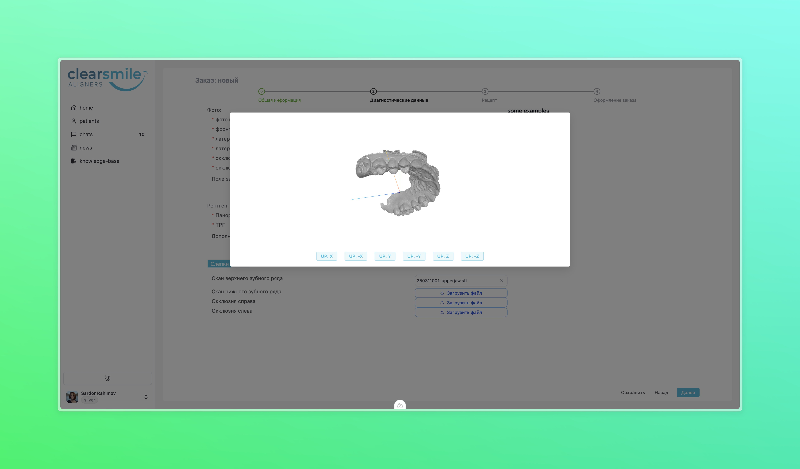

<h1 align="center">Hi, I'm Adham Muhammadjonov 👋</h1>

  <a href="mailto:john.doe@email.com">adham.muhammadjonov1923@gmail.com</a> •
  <a href="https://www.linkedin.com/in/adham-muhammadjonov/" target="_blank">LinkedIn</a> •
  <a href="https://t.me/adham0001" target="_blank">Telegram</a> •
  <a href="https://github.com/Adham2023" target="_blank">GitHub</a>

---

## 💼 Summary

I'm a full-stack developer with a strong foundation in **Vue.js**, **Node.js**, and **MongoDB**, passionate about building robust web and mobile applications. I began my journey as a frontend developer and quickly expanded into backend development, infrastructure setup, and DevOps. Over the years, I've delivered end-to-end solutions — from CI/CD pipelines and remote server management to self-hosted map systems using **OpenStreetMap**, and cross-platform mobile apps with **React Native** and **SwiftUI**.

One of my most challenging and rewarding projects was a 3D dental treatment visualization system built with **Nuxt3** and **Three.js**, integrating **Google Cloud Storage** for dynamic 3D model loading. The platform consisted of a visualization frontend, admin dashboard, and a REST API backend. I also led the development of a companion treatment management system for the same client, showcasing my ability to manage complex, multi-component architectures.

---

## 🧰 Tech Stack

---

## 🧩 Projects

### 🎨 Alfam - Tile sellers admin/controlling app
> It was project with very difficult clients, but at the end I managed to compelete the project. Main components were that creating types of the tiles, saving them to warehouse with batches and sales structure was very complex, there customer which are actaully another sellers, debts control, and another thing is that sales might be changed according to customer want might replace their tile to another tile but based on some specific sale and system had to calculate the payment's difference whethere they have to pay back or ask additional payment. 

- 🛠 Built with `Vue3`, `Node.js`, `MongoDB`
- 📱 Supports Web/Desktop
- 👀 Private app

---

### 🏥 Clear-Smile 3D plan visualization – 3D scene teeth treatment plans
> This app was real challange for me because it was mostly about 3D renderings. I did not created any 3D/webgl apps before from scratch. I was askend many diffuclt features like:
>  Rulers - to measure the distance between two points placed at 3d model,
> Grid-Scale overlay - which opeque overlay with vertically and horizontally crossed lines which in between equally spaced and each line has specific measured labels and these measurement is calculated based on Camera Type and distance with special variables.
>  Occlusogram - is the heat map which represents penetration and distance with [-1, 1] mm threshold if penetrates marks with red if in distance it is blue and as a result we got the heatmaps. For this to work 
> Loading and adding skull parts of the patient head to the teeths scene.
> Slider to show each change steps as animation
- ⚙️ Tech: `Nuxt3`, `Node.js`, `Google Bucket`, `MongoDB`
- 🔒 For now there is not login but links are shared securely.

[🔗 Repository](https://github.com/yourusername/medicalchat)

---

### 🏥 Clear-Smile 3D plan visualization Admin web app – to create plan and loading the 3d models.
> Creating, Listing, Editing, Deleting the Plan
> There are other metadata info to load into the plan other than 3d models, which can be printed and shown as table in the 3D visualizer. 
- ⚙️ Tech: `Vue`, `Node.js`, `Google Bucket`, `MongoDB`, `Element-Plus`
- 🔒 Secure login + user roles

[🔗 Repository](https://github.com/yourusername/medicalchat)

---

### And other multiple small mid range Projects

## 📈 Work Experience

### 🔹 Senior Full Stack Developer  
**Beelab.** · Jan 2022 - 2023   
Full-time_
- I created back office for an e-commerce at Beeline/Beelab. Started from scratch developed users system, products catalogs, categories etc. Did important integrations with OFD and Billz to send receipts and to sync merchants databases real-time accordingly. Also worked as part e-commerce website team which is created using Nuxt 3 and contributed to that part as well.

## UzTransgas | Tashkent | Front-end, API Developer | June 2019 - May 2020

Modification company's website
Connecting web-services like payment systems, tax system etc. with company's system.
Querying verious reports (using node.js)
Started building modern look of available system and functionality (using Vue.js, Node.js, Java, I was Front-end developer position, team size was only 3)

## Public-service LLC - Tashkent | Frontend developer, API developer | May 2020 - August 2021 | Link web-app (Not Pulbic application) : ASKUGYUR

We started develping large scale project with 4 team members, I was only front-end developer, and I created this web app from scratch, I worked 6-7 month on this project.
I also created verious API, and API consumer clients services for getting daily usage of gas and daily payment from abonents and successfully connected and stored data to SQL-server database.
## Modeme - team - Fullstack | January 2022 - July 2022
- Here I asked to help to make full stack app to production, that's the reason of my short working time.

---

## 🎓 Education

**B.Sc. in Computer Science**  
Inha University, 2016 – 2019

---

## 📫 Contact Me

- 📧 Email: [adham.muhammadjonov1923@gmail.com](mailto:adham.muhammadjonov1923@gmail.com)
- 🌐 Website: [https://adhamsdiscovery.com]([https://yourwebsite.com](https://adhamsdiscovery.com))
- 🧾 Resume PDF: [Download](./resume.pdf)

---

Last updated on: June 3, 2025
