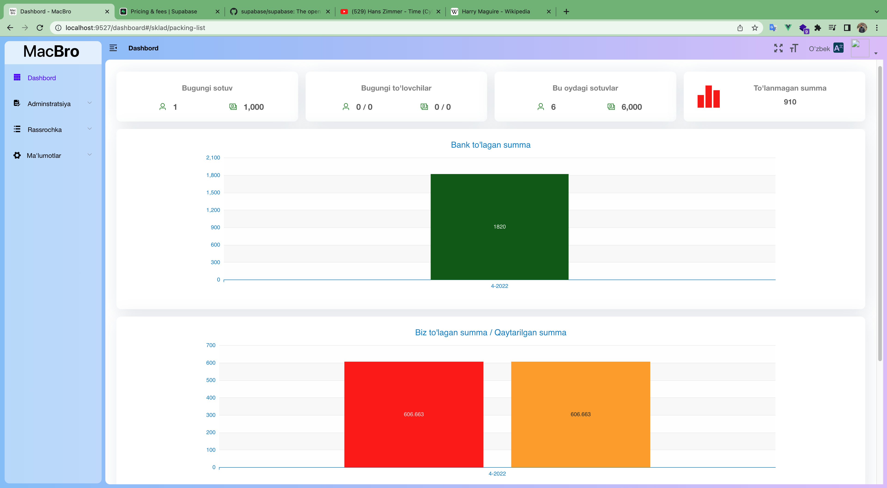
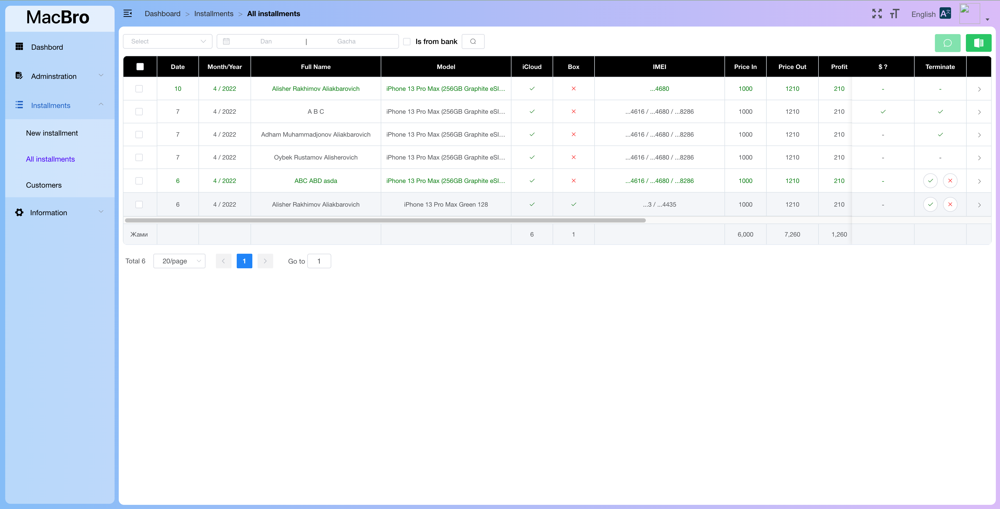
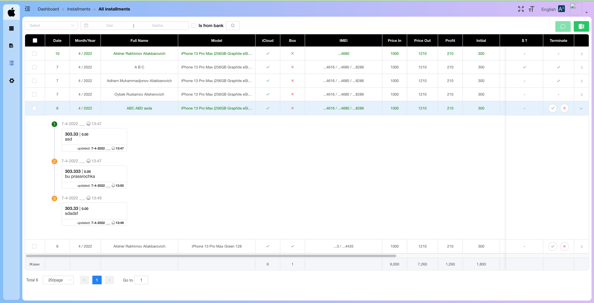
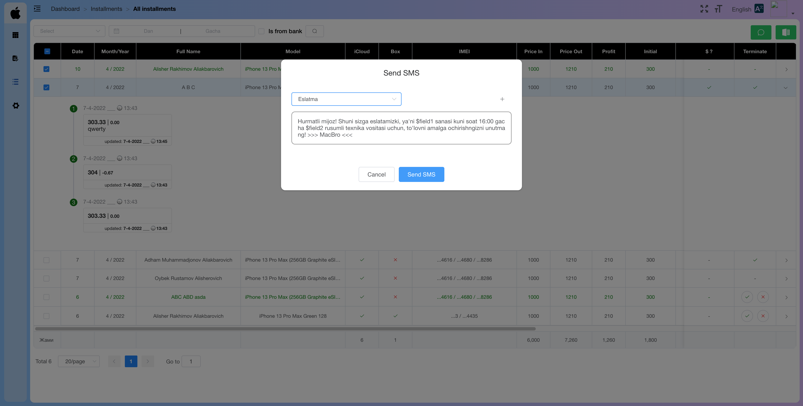

# Adkham Mukhammadjonov

### Front-end developer

[Email](mailto:adham.muhammadjonov1923@gmail.com) | [Telegram](t.me/adham0001) | [LinkedIn](https://www.linkedin.com/in/adham-muhammadjonov)

Full-stack Developer with experience working on projects involving JavaScript, Vue , Vuex, HTML/CSS Preprocessors (LESS/SASS), RESTful APIs, MongoDB and version control (Git).

# Skills

- **Mobile-dev/framework**: Nativescript-vue, Flutter
- **Backend/framework**: Node.js, Express
- **Databse**: MongoDB, SQL-server
- **Language** : Javascript(ES6), Typescript, Dart
- **Web development**: HTML, CSS , Sass , VueJS 2-3, Nuxt, PWA, Vuex, Vue–Router, JSON, Apex-charts
- **UX/UI** : Adobe XD beginner
- **CSS frameworks** : Element-UI, Bootstrap, UnoCSS, TailwindCSS
- **Additional** : Experience with collaborative development tools (Git , GitHub , Gitlab) , Webpack , Postman , Swagger , Yarn & NPM packages Slack, pm2, Vite2
- **OS** : MacOS, Windows, 7 Ubuntu 16.04, 17.01.

# Programming

4 Year programming experience

3 year working experience

# Experience

**UzTransgas** | Tashkent | Front-end, API Developer | June 2019 - May 2020

- Modification company's website
- Connecting web-services like payment systems, tax system etc. with company's system.
- Querying verious reports (using node.js)
- Started building modern look of available system and functionality (using Vue.js, Node.js, Java, I was Front-end developer position, team size was only 3)

**Public-service LLC** - Tashkent | Frontend developer, API developer | May 2020 - August 2021 |
Link web-app (Not Pulbic application) : [ASKUGYUR](https://askugyur.hududgaz.uz)

- We started develping large scale project with 4 team members, I was only front-end developer, and I created this web app from scratch, I worked 6-7 month on this project.
- I also created verious API, and API consumer clients services for getting daily usage of gas and daily payment from abonents and successfully connected and stored data to SQL-server database.

# Side projects

- [Currency-Converter](https://converter-test-app.netlify.app/), This is a test app and uses open api from [https://www.cbr-xml-daily.ru/daily_json.js](https://www.cbr-xml-daily.ru/daily_json.js)
- [Muallimi-soniy](https://appadvice.com/game/app/muallimi-soniy/1521714189), This is mobile application. I created it using native-script-vue cross-mobile framework.
- [Alfam](), This is the proejct for a construction and build related shop, client was intereseted in seeing his daily profit, workers participation on sale, and storing his all available items data to a database and getting verious reports about shop activity.
- Also created a web app client for Telegram-API, now under development
  - achieved: Authenticate using phone number or QR scanning, sending and receive message, read status check...
- **Macbro - Installments CRM**: I developed it from scratch. From DB Schema design to UI, Completed the project within almost 2 weeks. It has functionalities like: Sending SMS to customers, Role/Permission based authorization, Export to excel.
  - used techs
    - MongDB
    - NodeJS
    - Typescript
    - Element-UI
    - Vuejs-2
  - Some screenshots
    
    
    
    

# LANGUAGES

- Uzbek - Native
- Russian - Intermediate
- English - Intermediate
